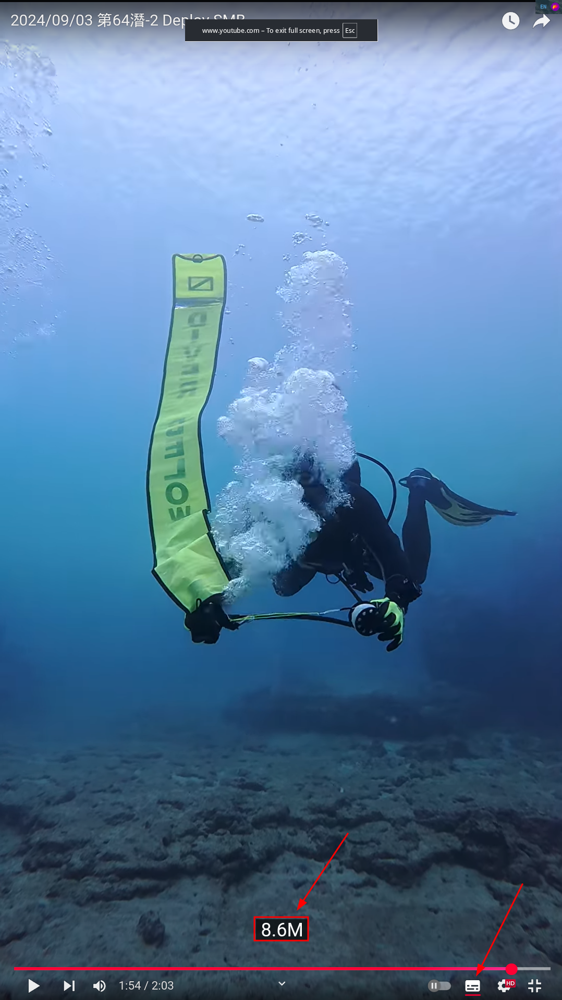
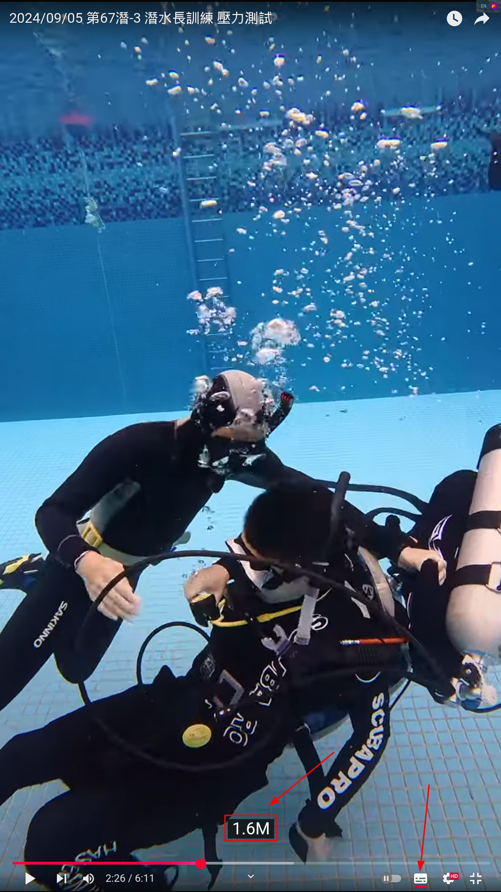

Fit2srt
---

Generate SRT subtitles from FIT for diver

### Usage
With Nix build system, you can easy to run this command

`nix run github:yanganto/fit2srt`

### Example
There are subtitles with realtime depth in following dive video.  The subtitles are generate by this tool.
- [SMB Deploy](https://www.youtube.com/watch?v=ro4Y1-1ny4M)
  
- [Stress Test of Dive Master Training](https://www.youtube.com/watch?v=gxGQsMdCE8Q)
  
