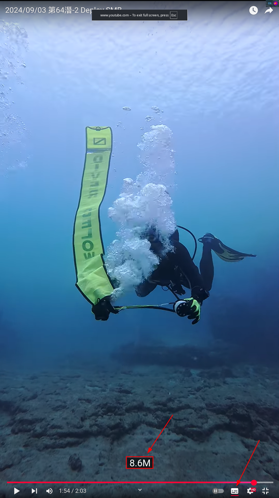
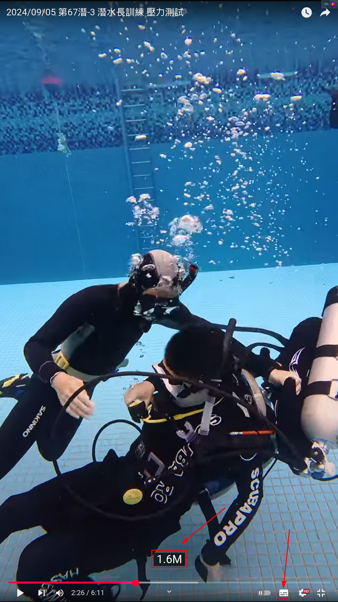

Fit2srt
---

Generate SRT subtitles from FIT for diver

### Usage
With Nix build system, you can easy to run this command

`nix run github:yanganto/fit2srt`

### Gui
Gui app is now in workable version.
Please check the [video](https://youtu.be/UW_9R-bM__Q) to learn more.

### Example
There are subtitles with realtime depth in following dive video.  The subtitles are generate by this tool.
- [Video for SMB Deploy](https://www.youtube.com/watch?v=ro4Y1-1ny4M)
  
- [Video for Stress Test of Dive Master Training](https://www.youtube.com/watch?v=gxGQsMdCE8Q)
  

### Donate QRs
#### Paypal
[https://www.paypal.com/ncp/payment/EH3BJ4MSTFQN4](https://www.paypal.com/ncp/payment/EH3BJ4MSTFQN4)

#### BTC Address 3QQ6vmEvjznxqSub4hCQRymicT2kKCcLzd

